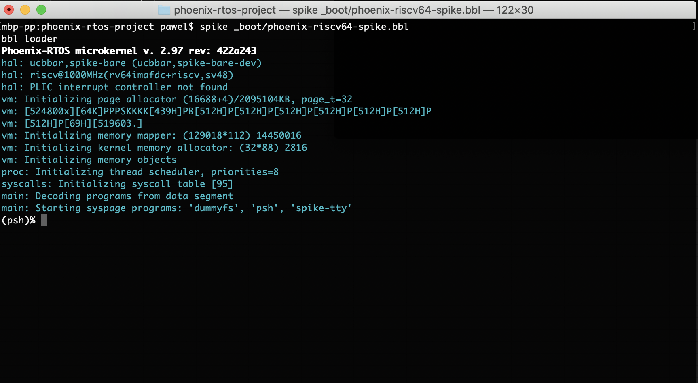
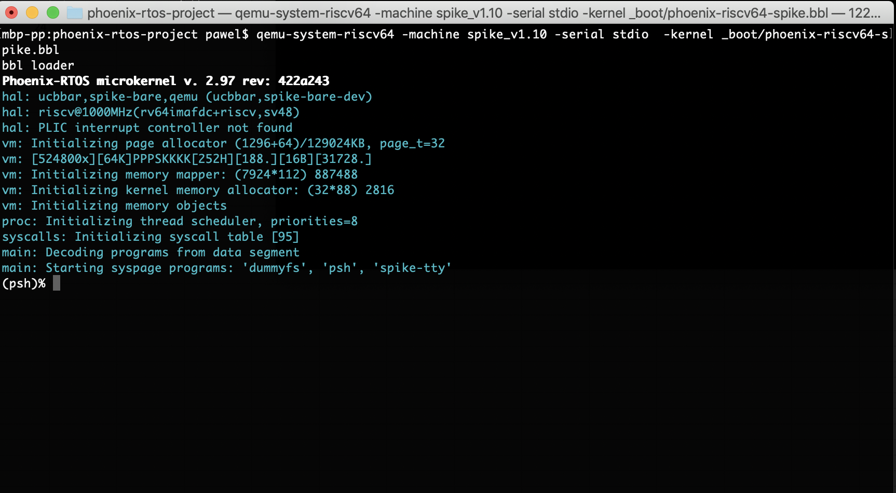
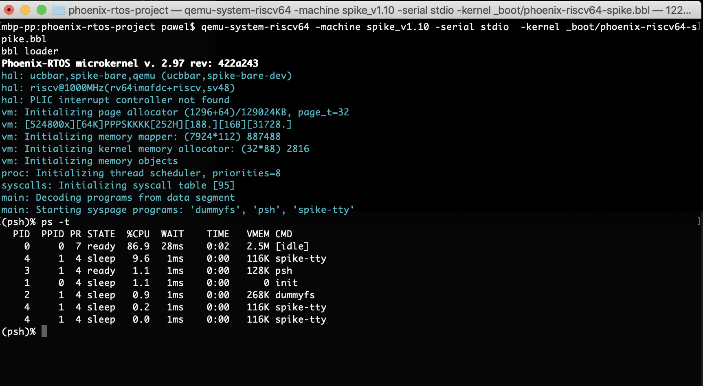

# riscv64-spike
This version is designated for RISC-V 64 processor based spike machine implemented by spike (riscv-isa-sim) emulator and `qemu-system-riscv64`. To launch this version
kernel file integrated with SBI firmware with embedded SBI console driver, dummyfs filesystem and `psh` shell should be downloaded.

The kernel file image can be downloaded from

## Running image under spike
To run image under spike you should type:

```
  spike _boot/phoenix-riscv64-spike.bbl
```



## Running image under qemu
To run image under qemu you should type:

```
  qemu-system-riscv64 -machine spike_v1.10 -serial stdio  -kernel _boot/phoenix-riscv64-spike.bbl
```



Phoenix-RTOS will be launched and `psh` shell command prompt will appear in the terminal. To get the available command list please type `help`. To get the list of working threads and processes please type `ps -t`.


