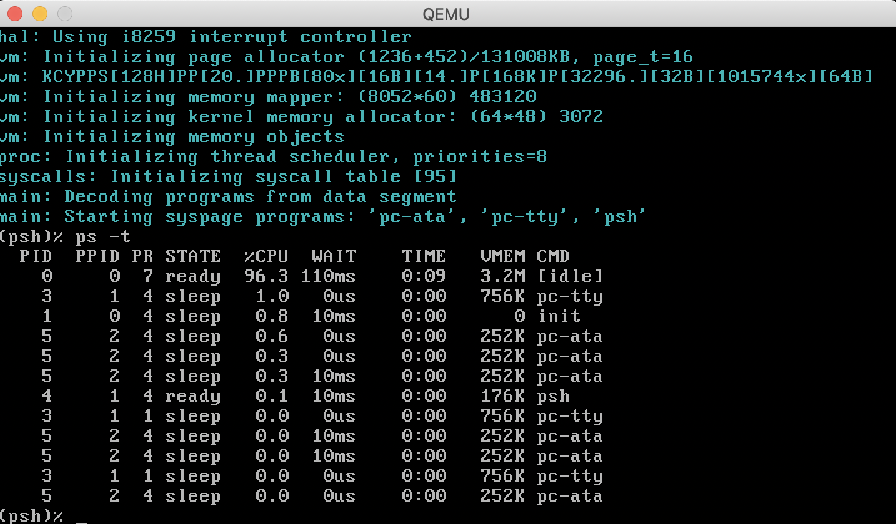
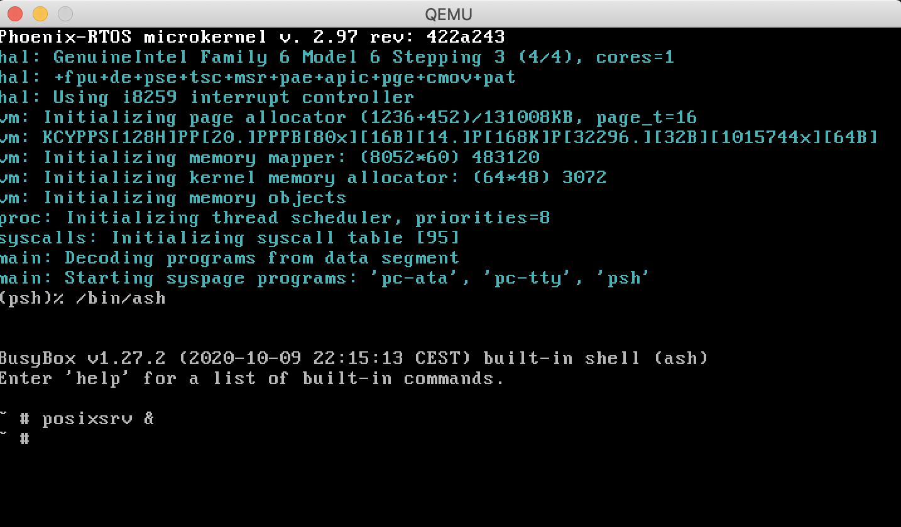

# ia32-generic
This version is designated for generic PC based on IA32 processor. To launch this version the final disk image should be downloaded. The image is created as the final artifact of project building and is located in `_boot` directory. The image consist of bootloader (plo), kernel, TTY VGA driver, ATA driver with ext2 filesystem.

The disk image can be downloaded from 

## Running image under qemu
To run image under qemu you should type:

```
  qemu-system-i386 -hda _boot/phoenix-ia32-generic.disk`
```


Phoenix-RTOS will be launched and `psh` shell command prompt will appear in the terminal. To get the available command list please type `help`. To get the list of working threads and processes please type `ps -t`.



To launch UN*X environment POSIX emulation server and `ash` shell should be launched using following commands.

```
  (psh)% /bin/ash
  # posixsrv &`
```



## Running image on regular hardware


